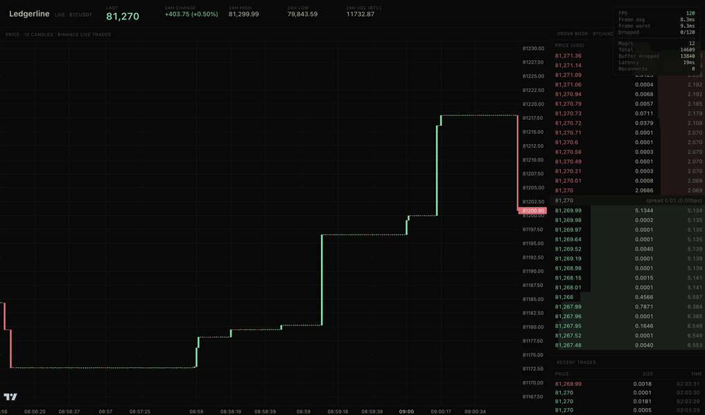

# Ledgerline

Real-time crypto trading interface engineered for zero layout shift and zero dropped frames. Streams live BTC/USDT from Binance over WebSocket — candlestick chart, depth-aware order book, virtualized trades tape — with a live perf overlay showing FPS and message rate.

**[→ Live demo](https://ledgerline-omega.vercel.app)**



  

## Stack

React 18 · TypeScript 5.6 · Vite 8 · [Lightweight Charts](https://github.com/tradingview/lightweight-charts) (TradingView's production chart library) · Binance public WebSocket API.

## What it does

- **Live candlestick chart** — 1-second OHLCV candles built from the raw trade tick stream, rendered with TradingView's Lightweight Charts.
- **Order book** — top 15 levels of bids and asks with cumulative-depth bars, refreshing every 100ms from Binance's partial book stream.
- **Trades tape** — virtualized scrolling list of the most recent 500 trades, color-coded by aggressor side.
- **Header ticker** — last price, 24h change/high/low/volume.
- **Performance overlay** — live FPS, frame timing, dropped-frame count, message rate, latency, reconnects.

## Performance

Measured against a sustained live Binance feed:

- **120 FPS sustained**, 8.3ms average frame time, 9.3ms worst frame
- **0 dropped frames** across 120 sampled frames
- **0 CLS** (Cumulative Layout Shift) throughout the load sequence — every panel reserves height before data arrives
- **~12 msg/sec** typical ingest rate from the multiplexed Binance stream, **19ms latency**, 0 reconnects in a typical session

(Numbers above are what the live perf overlay reports in the linked demo.)

## Architecture

```
src/
├── lib/
│   ├── binanceClient.ts     # Multiplexed WS client with reconnect + backpressure
│   ├── candleAggregator.ts  # Trade ticks -> OHLCV candles
│   ├── orderBook.ts         # Sorted book engine for depth events
│   └── frameTimer.ts        # rAF-based FPS instrumentation
├── components/
│   ├── Chart.tsx            # Candlestick chart
│   ├── OrderBook.tsx        # Depth visualization
│   ├── TradesTape.tsx       # Virtualized trade list
│   ├── PerfOverlay.tsx      # FPS + msg/sec overlay
│   └── Header.tsx           # Symbol + 24h stats
└── hooks/
    ├── useBinanceStream.ts
    └── useFrameStats.ts
```

### Single multiplexed WebSocket

All streams (`@trade`, `@depth20@100ms`, `@miniTicker`) share one connection to `wss://stream.binance.com:9443/stream` via the `BinanceClient`. The client supports:

- SUBSCRIBE / UNSUBSCRIBE messages over a single socket
- Per-stream subscriber registries with fan-out to multiple listeners
- Ring-buffer backpressure: when a stream's buffer exceeds a cap, oldest messages are dropped (counted in stats) so a slow consumer can't OOM the page
- Automatic reconnect with exponential backoff (1s → 2s → 4s → … → 30s cap)
- On reconnect, all active stream subscriptions are re-registered

### Layout-shift prevention

Every panel reserves its final height before data arrives:

- Chart container has `min-height: 300` and `contain: strict`
- Order book reserves `(rowHeight × levels × 2) + spreadRow` even while empty
- Trades tape reserves a fixed `height` and shows a placeholder until the first trade

This keeps Cumulative Layout Shift at 0 throughout the load sequence.

### Render budget

- Chart updates use `series.update()` which mutates the live candle in place — no full series rebuild per tick
- Trades tape throttles React state updates to 10 Hz; new trades accumulate in a ref between renders
- Order book updates at the rate of the depth feed (10 Hz) directly via setState — list size is bounded
- Trades list is virtualized (only visible rows + 4-row buffer mount)
- The performance overlay updates at ~5 Hz, not per-frame

### Production verification

Ledgerline has three layers of validation:

- Unit tests cover candle aggregation, order book math, subscriber replay/unsubscribe behavior, and invalid feed handling.
- Production smoke tests run against `vite preview` in desktop and mobile Chromium.
- The smoke suite mocks the Binance WebSocket feed in-browser so CI verifies rendering, virtualization, responsive layout, chart mounting, order book hydration, and trade tape behavior without depending on external network availability.

## Quality Gates

```bash
npm run lint       # ESLint + React hooks checks
npm run typecheck  # TypeScript project build
npm run test       # Vitest realtime engine coverage
npm run build      # Production Vite build
npm run smoke      # Playwright desktop/mobile smoke tests
```

GitHub Actions runs production audit, lint, typecheck, unit tests, build, installs Chromium, then executes the Playwright smoke suite against the production preview server.

## Running

```bash
npm install
npm run dev
```

Open http://localhost:5174/. You'll see live BTC/USDT data flowing in within a second or two — the chart fills as candles aggregate, the order book and trades tape populate immediately.

**Requirements:** A modern browser (Chrome, Safari, Firefox) and an outbound WebSocket connection to `stream.binance.com`. Some corporate networks block the connection.

## What I'd build next

If this were a real product, the next iterations would be:

- **Multi-symbol** — symbol picker, persistent watchlist, side-by-side micro-charts. The WS client already supports it; just needs UI.
- **Server-side aggregation** for older history — Binance's WS only gives you live data, so any "show me yesterday" view needs a REST backfill layer.
- **Auth and saved layouts** — let users customize panel sizes and remember positions across sessions.
- **More granular perf telemetry** — long-task tracking, paint timing breakdown, per-component render counts. The overlay is a good start but doesn't yet cover everything I'd want in production.

## License

MIT
