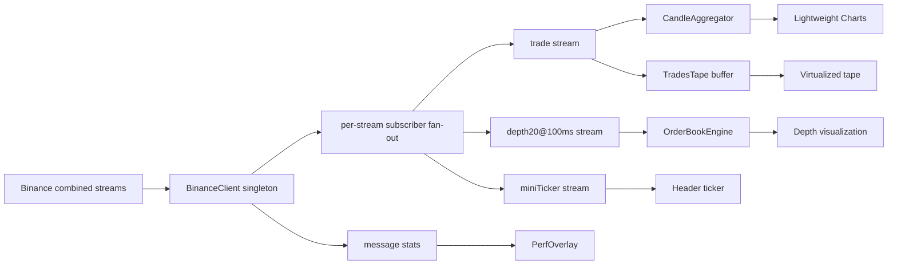

# Ledgerline Architecture

Ledgerline is a realtime market interface that turns Binance WebSocket events into a dense trading surface: candlesticks, order book depth, trades tape, ticker stats, and live performance telemetry. The project is designed to prove frontend skill in realtime ingestion, bounded rendering, chart integration, and layout stability.

## Product Boundary

Ledgerline is not an exchange and it does not place orders. Its boundary is a read-only market data terminal:

- Stream BTC/USDT trades, depth, and mini-ticker events.
- Aggregate raw trades into 1-second candles.
- Render a depth-aware order book.
- Render a virtualized trades tape.
- Show frame timing, message rate, latency, and reconnects.
- Keep the layout stable before and after data hydration.

That narrow scope keeps risk low while still demonstrating realtime system design.

## Realtime Flow

The app uses one shared WebSocket client instead of one socket per panel. Components subscribe to streams through `useBinanceStream`, which stores the latest handler in a ref so React renders do not trigger unnecessary unsubscribe/resubscribe churn.

## WebSocket Client

`src/lib/binanceClient.ts` owns connection behavior:

- Single combined-stream WebSocket.
- Subscribe/unsubscribe commands over that connection.
- Per-stream listener registries.
- Buffered replay for late subscribers.
- Backpressure through capped per-stream buffers.
- Exponential reconnect with active stream re-registration.
- Public stats for received messages, dropped messages, reconnects, and latency.

The browser app uses `wss://data-stream.binance.vision/stream`, Binance's market-data-only endpoint, which is appropriate for read-only UI demos.

## Data Engines

`CandleAggregator` converts raw trade ticks into OHLCV candles. The chart updates the active candle in place instead of rebuilding a full series for every tick.

`OrderBookEngine` consumes partial depth snapshots, normalizes bid/ask levels, computes cumulative sizes, spread, midpoint, and max depth for visual bars.

Both engines are independent of React and covered by Vitest so realtime math can be tested without rendering the app.

## Rendering Strategy

- Lightweight Charts handles the canvas-based candlestick chart.
- Trades tape state is throttled so React does not render on every WebSocket message.
- Trades tape is virtualized, mounting only the visible row window plus a small buffer.
- Order book list size is bounded to top levels.
- Performance overlay updates at a lower cadence than the frame loop.
- CSS reserves panel dimensions before data arrives to avoid layout shift.

## Layout Stability

Ledgerline treats layout shift as a product bug. The chart, order book, trades tape, and header reserve stable dimensions, and the Playwright smoke suite checks responsive rendering against deterministic mocked market data.

## Testing Strategy

Unit tests cover:

- Candle aggregation and candle retention.
- Order book cumulative depth, midpoint, and spread math.
- WebSocket subscriber replay and unsubscribe behavior.
- Invalid feed handling.

Production smoke tests cover:

- App shell rendering.
- Mocked Binance WebSocket hydration.
- Chart mount.
- Ticker updates.
- Order book rows.
- Trades tape rows and virtualization.
- Desktop/mobile responsive layout.

## Production Backend Target

A production trading analytics product would add:

- Server-side historical candle backfill.
- Symbol search and watchlists.
- User-authenticated saved layouts.
- Worker or server aggregation for heavier symbol sets.
- Durable telemetry for reconnects and feed latency.
- Multi-region market data fan-out to reduce client socket load.

The current client architecture can evolve toward that model because WebSocket ingestion, aggregation, rendering, and perf telemetry are already separated.

## Interview Talking Points

- Why a single multiplexed WebSocket is preferable to per-widget sockets.
- How backpressure is handled in the browser.
- Why the chart mutates the current candle instead of rebuilding all candles.
- How throttling and virtualization protect React render budget.
- How deterministic WebSocket mocks make CI reliable.
- What moves server-side when adding historical data or many symbols.
